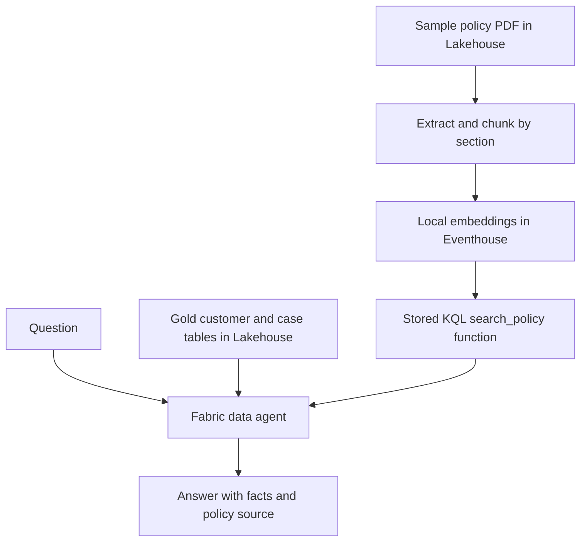

# AI layer on a Microsoft Fabric data stack

A small customer service demonstration showing how existing Fabric components can make engineered data and policy documents available through a conversational agent. The [four-page visual PDF](Fabric_AI_Layer_LinkedIn_Carousel.pdf) is formatted as a LinkedIn carousel.

## Architecture

The gold data path uses the data agent's NL2SQL capability. The policy path uses a local small embedding model, `harrier-v1-270m`, and Eventhouse vector similarity. A KQL function named `search_policy(question)` returns the most relevant policy sections and their source filename. The published agent can optionally be exposed as an MCP tool to a compatible client.

## Demonstration scope

- Five synthetic customers and eight synthetic service cases in two gold Lakehouse tables.
- One fictional customer service policy PDF, extracted into five section-level passages.
- Five embedded passages stored in an Eventhouse `PolicyChunks` table.
- Direct vector retrieval checked with escalation and refund questions.
- Fabric data agent configured with gold tables and Eventhouse search function; individual routes should be validated in the agent's run steps.

No upstream bronze or silver pipelines, production Oracle database, or Azure AI Search service are part of this demonstration. This repository contains an explanatory artifact, not exported Fabric workspace items or credentials.

## Reproduce the pattern

1. Prepare business-ready Lakehouse tables, with clear names and join keys.
2. Land PDFs in Lakehouse Files. Extract text, split into passages, and retain source and section metadata.
3. Enable the Eventhouse Python plugin, install the local SLM function, and embed passages into an Eventhouse table.
4. Test vector search directly in KQL. Save it as a parameterized function such as `search_policy(question)`.
5. Add the Lakehouse and KQL database to a Fabric data agent. Select relevant tables and functions, add routing instructions and example queries, and inspect generated SQL/KQL in run steps.
6. Publish the agent only after structured, policy, and combined questions pass your checks. The published agent's MCP endpoint is optional for external clients.

## Example question

> How many cases are open, and when does the policy require escalating a high-priority case?

The count should come from the gold case table. The rule should come from the retrieved policy section, with its source filename. Do not compute live case status from a static policy PDF.

## Microsoft documentation

- [Fabric data agents](https://learn.microsoft.com/en-us/fabric/data-science/concept-data-agent)
- [Lakehouse SQL analytics endpoint](https://learn.microsoft.com/en-us/fabric/data-engineering/lakehouse-sql-analytics-endpoint)
- [Eventhouse vector search with local SLM embeddings](https://learn.microsoft.com/en-us/fabric/real-time-intelligence/vector-database-eventhouse-small-lang-model)
- [Fabric data agent as an MCP server](https://learn.microsoft.com/en-us/fabric/data-science/data-agent-mcp-server)

**Note:** All customer details and policy rules in the demo are synthetic. Local embeddings avoid a separate embedding API charge; Fabric capacity is still required.
